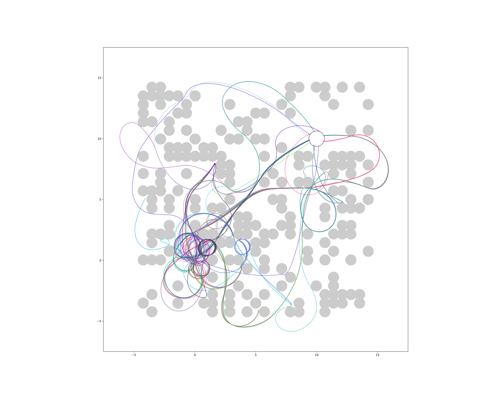

REF: [github docs](https://docs.github.com/en/get-started/writing-on-github/getting-started-with-writing-and-formatting-on-github/basic-writing-and-formatting-syntax)

# A first-level heading
## A second-level heading
### A third-level heading

# A 2nd first-level heading
## A 2nd second-level heading
### A 2nd third-level heading

# A 3rd first-level heading
## A 3rd second-level heading
### A 3rd third-level heading

**bold text**
_italic text_
**bold _italic_ text**
***all bold italic text***

This is a subscript text

This is a superscript text

This is an <ins>underlined</ins> text

- [ ] to do
- [ ] to don't
- [x] to did
